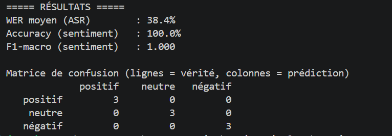

# 🎙️ Détection de Sentiment dans les Appels Vocaux

> Projet Final — Module Deep Learning 2 — Dakar Institute of Technology (2026)

> 🚀 **Démo en ligne** : https://huggingface.co/spaces/MARIEMEFAYE/SENTIMENT_DETECTION

Pipeline automatisé qui transcrit un appel vocal client en français (**Wav2Vec 2.0**) puis classe le sentiment exprimé en trois classes — **positif**, **négatif**, **neutre** — avec un score de confiance (**DistilCamemBERT**).

---

## 1. Architecture

```
Audio (.wav / .mp3)
      │
      ▼
┌─────────────────────┐
│   Prétraitement     │  conversion mono, rééchantillonnage 16 kHz,
│  (audio_utils.py)   │  normalisation d'amplitude, validations
└─────────────────────┘
      │
      ▼
┌─────────────────────┐
│   ASR — Wav2Vec 2.0 │  transcription français → texte
│      (asr.py)       │  découpage en segments de 30 s (mémoire CPU)
└─────────────────────┘
      │
      ▼
┌─────────────────────┐
│ Sentiment — BERT    │  DistilCamemBERT 5 classes → regroupement
│   (sentiment.py)    │  en 3 classes + règle de seuil de confiance
└─────────────────────┘
      │
      ▼
{ transcription, sentiment, score, detail }
```

Le pipeline est exposé de trois manières :
- une **interface Gradio** (`demo/gradio_app.py`) pour la démonstration interactive ;
- une **API REST FastAPI** (`api/main.py`) pour l'intégration dans d'autres applications ;
- une **démo publique** déployée sur Hugging Face Spaces : lien : https://huggingface.co/spaces/MARIEMEFAYE/SENTIMENT_DETECTION 
 

## 2. Modèles utilisés et justification

| Rôle | Modèle | Justification |
|---|---|---|
| ASR | [jonatasgrosman/wav2vec2-large-xlsr-53-french](https://huggingface.co/jonatasgrosman/wav2vec2-large-xlsr-53-french) | Wav2Vec 2.0 fine-tuné sur le français (Common Voice) ; modèle recommandé par le sujet ; bon compromis qualité/ressources sur CPU |
| Sentiment | [cmarkea/distilcamembert-base-sentiment](https://huggingface.co/cmarkea/distilcamembert-base-sentiment) | CamemBERT = BERT pré-entraîné sur le français, cohérent avec des appels francophones ; version distillée ≈ 2× plus rapide (important sur CPU) ; fine-tuné sur des avis clients (Amazon/Allociné), domaine proche des appels clients |

### Choix d'ingénierie

**Regroupement 5 → 3 classes.** Le modèle de sentiment prédit 5 classes (1 à 5 étoiles). Conformément au sujet, elles sont regroupées en sommant les probabilités : 1–2 ⭐ → *négatif*, 3 ⭐ → *neutre*, 4–5 ⭐ → *positif*. La somme des trois scores vaut toujours 1, ce qui donne au score de confiance une interprétation probabiliste propre.

**Règle de seuil pour le neutre.** Les messages réellement positifs ou négatifs produisent des scores très tranchés (> 90 % observés en pratique). Lorsqu'aucune classe ne dépasse **50 %** de confiance, le message est classé *neutre* : l'hésitation du modèle est interprétée comme une absence d'émotion dominante. Le score affiché reste la probabilité brute de la classe retenue — un score bas signale donc honnêtement une prédiction incertaine.

## 3. Installation

Prérequis : Python ≥ 3.9, ~4 Go d'espace disque (modèles inclus).

```bash
git clone https://github.com/MariemeFAYE/sentiment_Detection.git
cd sentiment_Detection

python -m venv venv
source venv/bin/activate        # Windows: venv\Scripts\activate

pip install -r requirements.txt
```

Au premier lancement, les modèles (~1,5 Go) sont téléchargés automatiquement depuis Hugging Face et mis en cache.

## 4. Utilisation

### Interface Gradio

```bash
python -m demo.gradio_app
```

Puis ouvrir http://127.0.0.1:7860 — chargement d'un fichier **ou** enregistrement direct au micro, affichage de la transcription intermédiaire, du sentiment avec code couleur et des probabilités par classe.

### API REST

```bash
uvicorn api.main:app
```

Documentation interactive (Swagger) : http://127.0.0.1:8000/docs

**Exemple d'appel curl :**

```bash
curl -X POST "http://127.0.0.1:8000/predict" -F "file=@tests_audio/demo_positif.wav"
```

> **Note Windows/PowerShell** : utiliser `curl.exe` au lieu de `curl` (dans PowerShell, `curl` est un alias d'Invoke-WebRequest et ne reconnaît pas les options standard).

**Exemple d'appel Python :**

```python
import requests

with open("tests_audio/demo_positif.wav", "rb") as f:
    r = requests.post("http://127.0.0.1:8000/predict", files={"file": f})
print(r.status_code, r.json())
```

**Réponse type (200) :**

```json
{
  "transcription": "je suis vraiment très satisfaite de votre service tout était parfait merci beaucoup",
  "sentiment": "positif",
  "score": 0.9872,
  "detail": {"négatif": 0.0041, "neutre": 0.0087, "positif": 0.9872}
}
```

**Gestion des erreurs (400) :** format non supporté, fichier vide, audio silencieux ou durée > 5 minutes renvoient un code 400 avec un message explicite, par exemple :

```json
{"detail": "Extension '.txt' non supportée. Formats acceptés : .wav, .mp3"}
```

## 5. Docker

L'API peut être exécutée dans un conteneur isolé et reproductible :

```bash
docker build -t sentiment-vocal .
docker run -p 8000:8000 sentiment-vocal
```

L'API est alors disponible sur http://127.0.0.1:8000 (docs : /docs). L'image utilise `python:3.11-slim` et la version CPU de PyTorch pour rester légère. Les modèles sont téléchargés au premier démarrage du conteneur (choix assumé : image plus légère et build plus rapide, au prix d'un premier démarrage plus lent — l'alternative serait de pré-télécharger les modèles dans l'image, ~4 Go, pour un conteneur autonome).

## 6. Démo publique (Hugging Face Spaces)

L'interface Gradio est déployée publiquement sur **ZeroGPU** (allocation GPU dynamique via le décorateur `@spaces.GPU`) :

👉 https://huggingface.co/spaces/MARIEMEFAYE/SENTIMENT_DETECTION

Quatre exemples y sont pré-chargés : un par classe de sentiment, plus un « cas difficile » illustrant la règle de seuil.

## 7. Structure du projet

```
sentiment_Detection/
├── app/
│   ├── audio_utils.py      # prétraitement + validations (AudioError)
│   ├── asr.py              # transcription Wav2Vec 2.0
│   ├── sentiment.py        # classification DistilCamemBERT (3 classes + seuil)
│   └── pipeline.py         # orchestration de bout en bout
├── api/main.py             # API REST FastAPI (POST /predict)
├── demo/gradio_app.py      # interface Gradio
├── evaluation/
│   ├── annotations.json    # jeu de données annoté (références + labels)
│   └── evaluer.py          # calcul WER, accuracy, F1, matrice de confusion
├── tests_audio/            # fichiers de démonstration et d'évaluation
├── record.py               # utilitaire d'enregistrement micro
├── test_*.py               # scripts de test de chaque module
├── Dockerfile              # conteneurisation de l'API
└── requirements.txt
```

## 8. Démonstration

Trois fichiers de démonstration sont fournis dans `tests_audio/`, un par classe :

| Fichier | Sentiment attendu | Sentiment prédit | Confiance |
|---|---|---|---|
| `demo_positif.wav` | positif | ✅ positif | 99 % |
| `demo_negatif.wav` | négatif | ✅ négatif | 100 % |
| `demo_neutre.wav` | neutre | ✅ neutre | 26 %* |

\* Score bas attendu : la classe *neutre* est décidée par la règle de seuil lorsque le modèle n'exprime aucune conviction — le score reflète cette incertitude (voir § 2).

Vérification reproductible :

```bash
python test_demos.py
```

## 9. Évaluation quantitative

Évaluation sur un petit jeu de données annoté de 9 enregistrements (3 par classe), avec transcriptions de référence. Reproductible via :

```bash
python -m evaluation.evaluer
```



| Métrique | Valeur |
|---|---|
| WER moyen (ASR) | 38,4 % |
| Accuracy (sentiment) | 100 % (9/9) |
| F1-macro (sentiment) | 1.000 |

**Analyse.** Le WER, calculé après normalisation (minuscules, sans ponctuation ni accents), varie fortement selon l'articulation du locuteur (7 % à 67 % ; sur des phrases de ~10 mots, chaque mot erroné pèse ~10 points). Le résultat principal est la **robustesse du classifieur de sentiment aux erreurs de transcription** : les 9 fichiers sont correctement classés malgré un ASR imparfait, les mots porteurs d'émotion étant généralement bien transcrits. La taille de l'échantillon (n = 9) permet de démontrer le fonctionnement du pipeline, non de garantir une performance générale.

## 10. Limites connues

- **Noms propres** : le modèle ASR décode caractère par caractère sans modèle de langage ; les noms propres absents de ses données d'entraînement sont approximés phonétiquement et peuvent dégrader les mots voisins (observé : « je m'appelle Marième Faye » → « au chez ma palmarien feis apples »).
- **Sortie ASR brute** : transcription en minuscules, sans ponctuation — comportement normal du décodage CTC greedy.
- **Sensibilité à l'articulation** : le WER varie fortement selon le débit et l'articulation du locuteur (mesuré de 7 % à 67 % sur le jeu d'évaluation).
- **Messages mitigés** : un avis mi-positif mi-négatif (« le produit est bien mais la livraison trop lente ») produit des scores partagés et est classé *neutre* par la règle de seuil — choix assumé mais discutable selon le cas d'usage.
- **Robustesse du sentiment à l'ASR imparfait** : même avec une transcription partiellement erronée, les mots porteurs d'émotion suffisent souvent au classifieur (mesuré : 9/9 classés correctement malgré 38 % de WER moyen). L'inverse reste possible si un mot-clé émotionnel est mal transcrit.
- **Seuil de confiance (0.5)** : hyperparamètre fixé empiriquement ; il pourrait être optimisé sur un jeu de données annoté plus large.
- **Langue** : pipeline conçu pour le français uniquement.
- **Performance CPU** : compter quelques dizaines de secondes de traitement par minute d'audio sur un CPU standard (la démo en ligne bénéficie de l'accélération ZeroGPU).

## 11. Auteure

**Marième FAYE** — Master 2 Intelligence Artificielle, Dakar Institute of Technology (DIT).
